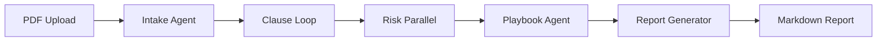

# 📄 AI-Powered Contract Review System

> **An intelligent multi-agent system for automated legal contract analysis using Google's Agent Development Kit (ADK)**

[](https://www.python.org/downloads/)
[](https://github.com/google/adk)
[](https://streamlit.io/)
[](https://opensource.org/licenses/MIT)

---

## 🎯 Purpose & Vision

This system automates the traditionally manual and time-consuming process of legal contract review by leveraging a multi-agent AI architecture. Built using **Google's Agent Development Kit (ADK)**, it demonstrates production-grade agentic AI patterns including sequential workflows, parallel processing, and loop agents working together to deliver comprehensive contract analysis.

### Problem Statement

**Traditional contract review challenges:**
- ⏰ **Time-intensive**: Manual review takes hours or days
- 💰 **Costly**: Requires expensive legal expertise
- ⚠️ **Error-prone**: Human oversight can miss critical clauses
- 📊 **Inconsistent**: Different reviewers apply varying standards
- 📈 **Not scalable**: Can't handle bulk contract processing

### Our Solution

An **AI-powered multi-agent system** that:
- ✅ Analyzes contracts in **minutes** instead of hours
- ✅ Provides **consistent, standards-based** reviews
- ✅ Identifies **critical risks** automatically
- ✅ Generates **comprehensive reports** in Markdown
- ✅ Enables **interactive Q&A** about contract terms
- ✅ Scales to **batch process** multiple contracts

---

## 🚀 Key Features

### 🤖 **Multi-Agent Architecture**
- **5 specialized AI agents** orchestrated by Google ADK
- **Sequential workflow** for systematic analysis
- **Parallel processing** for risk assessment efficiency
- **Loop agents** for thorough clause extraction

### 📊 **Comprehensive Analysis**
- Contract type classification (SaaS, Employment, NDA, MSA)
- Metadata extraction (parties, dates, jurisdiction)
- Clause-by-clause risk scoring (Critical/High/Medium/Low)
- Playbook compliance checking against company standards
- Executive summary with actionable recommendations

### 💬 **Interactive Q&A**
- Context-aware chatbot powered by Gemini
- Ask questions about any contract clause
- References both contract text and analysis report
- Multi-turn conversations with memory

### 📝 **Professional Reporting**
- Structured Markdown reports with emojis and tables
- One-click download as DOCX
- Copy-to-clipboard functionality
- Real-time agent trace visibility

### ⚡ **Batch Processing**
- Process multiple contracts in one run
- Automated report generation for entire folders
- Perfect for contract portfolio analysis

---

## 🏗️ Architecture

### High-Level System Design

```
┌─────────────────────────────────────────────────────────────┐
│                      USER INTERFACE                         │
│  🖥️ Streamlit Web App (PDF Upload, Report Display, Chat)   │
└────────────────────────┬────────────────────────────────────┘
                         │
                         ▼
┌─────────────────────────────────────────────────────────────┐
│              AGENT ORCHESTRATION LAYER                      │
│                                                             │
│  🎯 Root: SequentialAgent (contract_review_workflow)       │
│     │                                                       │
│     ├──▶ Stage 1: Intake Agent (Metadata Extraction)      │
│     │                                                       │
│     ├──▶ Stage 2: Loop Agent (Clause Extraction)          │
│     │           └─▶ Clause Extractor Agent                │
│     │                                                       │
│     ├──▶ Stage 3: Parallel Agent (Risk Scoring)           │
│     │           └─▶ Risk Scorer Agent (concurrent)        │
│     │                                                       │
│     ├──▶ Stage 4: Playbook Agent (Compliance Check)       │
│     │           └─▶ MCP Server (Standards Database)       │
│     │                                                       │
│     └──▶ Stage 5: Report Generator (Markdown Synthesis)   │
│                                                             │
└─────────────────────────────────────────────────────────────┘
                         │
                         ▼
┌─────────────────────────────────────────────────────────────┐
│                  EXTERNAL SERVICES                          │
│  ☁️ Google Gemini API (gemini-2.0-flash-exp)              │
│  💬 Google GenAI (Chat Q&A)                                │
└─────────────────────────────────────────────────────────────┘
```

### Agent Workflow



### Data Flow

1. **Input**: User uploads PDF contract
2. **Parsing**: Extract text and metadata
3. **Stage 1**: Classify contract type, extract parties/dates
4. **Stage 2**: Loop through sections to extract all clauses
5. **Stage 3**: Parallel risk scoring across clauses
6. **Stage 4**: Compare each clause to playbook standards (via MCP)
7. **Stage 5**: Synthesize comprehensive report
8. **Output**: Display report + enable Q&A chat

---

## 🛠️ Tech Stack

### **Core Framework**
- **Google ADK** - Agent Development Kit for multi-agent orchestration
- **Gemini 2.0 Flash** - LLM powering all 5 agents
- **Python 3.10+** - Primary language

### **UI & Frontend**
- **Streamlit** - Web interface and real-time updates
- **Mermaid** - Architecture diagrams
- **Custom CSS** - Dark mode styling

### **Tools & Utilities**
- **PyPDF2** - PDF text extraction
- **python-docx** - Report export to DOCX
- **MCP (Model Context Protocol)** - Playbook standards server
- **dotenv** - Environment variable management

### **External APIs**
- **Google Gemini API** - Agent LLM calls
- **Google GenAI** - Chat Q&A functionality

---

## 📦 Installation

### Prerequisites
- Python 3.10 or higher
- Google API key ([Get one here](https://ai.google.dev/))

### Step 1: Clone the Repository
```bash
git clone https://github.com/yourusername/legal-ai-project.git
cd legal-ai-project
```

### Step 2: Create Virtual Environment
```bash
python -m venv contract_reviewer
source contract_reviewer/bin/activate  # On Windows: contract_reviewer\Scripts\activate
```

### Step 3: Install Dependencies
```bash
pip install -r requirements.txt
```

### Step 4: Configure Environment
```bash
# Create .env file
cp .env.example .env

# Edit .env and add your API key
GOOGLE_API_KEY=your_api_key_here
```

---

## 🎮 Usage

### Option 1: Web Interface (Recommended)

```bash
streamlit run app.py
```

Then open your browser to: **http://localhost:8501**

**Features:**
- 📄 PDF viewer (left column)
- 📊 Report display (right column)
- 🕵️ Agent traces (sidebar)
- 💬 Interactive Q&A (bottom)
- 💾 Download as DOCX

### Option 2: Batch Processing

Process multiple contracts at once:

```bash
# 1. Place PDFs in input folder
cp /path/to/contracts/*.pdf input_contracts/

# 2. Run batch processor
python run_batch.py

# 3. Get reports from output folder
ls output_reports/
```

### Option 3: Single Contract CLI

```bash
python run_single.py path/to/contract.pdf
```

---

## 📁 Project Structure

```
legal_ai_project/
├── app.py                          # Streamlit web UI
├── run_single.py                   # CLI for single contract
├── run_batch.py                    # Batch processor
├── requirements.txt                # Python dependencies
├── .env.example                    # Environment template
│
├── src/
│   ├── __init__.py
│   ├── agent.py                    # 5 ADK agents + orchestration
│   ├── config.py                   # Configuration & model settings
│   │
│   ├── tools/
│   │   ├── __init__.py
│   │   ├── pdf_parser.py           # PDF text extraction
│   │   └── risk_matrix.py          # Risk scoring logic
│   │
│   ├── mcp/
│   │   ├── __init__.py
│   │   └── playbook_server.py      # MCP server for standards
│   │
│   └── utils/
│       ├── __init__.py
│       └── docx_generator.py       # Markdown to DOCX converter
│
├── data/
│   └── playbooks/
│       ├── employment_agreement.json
│       ├── saas_agreement.json
│       ├── nda.json
│       └── msa.json
│
├── input_contracts/                # Place PDFs here for batch
├── output_reports/                 # Generated reports
└── README.md
```

---

## 🤖 ADK Concepts Demonstrated

This project showcases **8 core ADK capabilities**:

| Category | Concept | Implementation |
|----------|---------|----------------|
| **Multi-Agent** | Sequential Agent | `contract_review_workflow` orchestrates 5 stages |
| | Loop Agent | `clause_extraction_loop` iterates through sections |
| | Parallel Agent | `risk_scoring_parallel` scores clauses concurrently |
| | LLM Agent | 5 specialized Gemini-powered agents |
| **Tools** | MCP Server | `PlaybookServer` for standards database |
| | Custom Tools | `pdf_parser`, `risk_matrix`, `docx_generator` |
| **Sessions** | State Management | `InMemoryRunner` + `st.session_state` |
| **Observability** | Logging & Tracing | `run_debug()` streams to UI sidebar |

---

## 📊 Sample Output

### Report Structure
```markdown
# Contract Review Report: AI Engineer Position Offer

## 1. Executive Summary
This report analyzes the offer letter for an AI Engineer position...

## 2. Critical Issues ❌
- **Unpaid Position**: The role offers no compensation...

## 3. High-Priority Issues ⚠️
- **Compensation Structure**: Explore stipend possibilities...

## 4. Acceptable Terms ✅
- Clear start and end dates
- Defined role and responsibilities
- Remote work arrangement

## 5. Negotiation Strategy
...

## 6. Clause-by-Clause Analysis
| Clause | Risk Level | Recommendation |
|--------|------------|----------------|
| Compensation | CRITICAL (9/10) | Negotiate paid alternatives |
| Term of Employment | LOW (1/10) | Acceptable |
...
```

---

## 🎯 Use Cases

1. **Startups**: Review vendor contracts before signing
2. **HR Teams**: Analyze employment offer letters for compliance
3. **Legal Ops**: Bulk process contract portfolios
4. **Small Businesses**: Get quick contract reviews without expensive lawyers
5. **Education**: Teach students about AI agents and legal tech

---

## 🔮 Future Enhancements

- [ ] **RAG Integration**: Vector search for large document collections
- [ ] **Long-term Memory**: Memory Bank for cross-contract insights
- [ ] **Agent Evaluation**: Automated testing framework
- [ ] **A2A Protocol**: Agent-to-agent communication
- [ ] **Multi-language Support**: Analyze contracts in Spanish, French, etc.
- [ ] **Redline Generation**: Auto-generate suggested edits
- [ ] **Workflow Customization**: User-defined playbooks

---

## 🤝 Contributing

Contributions are welcome! Please:

1. Fork the repository
2. Create a feature branch (`git checkout -b feature/amazing-feature`)
3. Commit your changes (`git commit -m 'Add amazing feature'`)
4. Push to the branch (`git push origin feature/amazing-feature`)
5. Open a Pull Request

---

## 📄 License

This project is licensed under the MIT License - see the [LICENSE](LICENSE) file for details.

---

## 🙏 Acknowledgments

- **Google ADK Team** - For the excellent Agent Development Kit
- **Streamlit** - For the intuitive web framework
- **Gemini API** - For powerful LLM capabilities

---

## 📧 Contact

**Sameer Narendra Jadhav**  
Capstone Project - AI-Powered Contract Review System

For questions or feedback, please open an issue on GitHub.

---

## 🎓 Academic Context

This project was developed as a capstone demonstration of:
- Multi-agent system design
- Production-grade AI orchestration
- Legal tech automation
- Full-stack AI application development

**Technologies**: Google ADK, Gemini 2.0, Streamlit, Python, MCP
